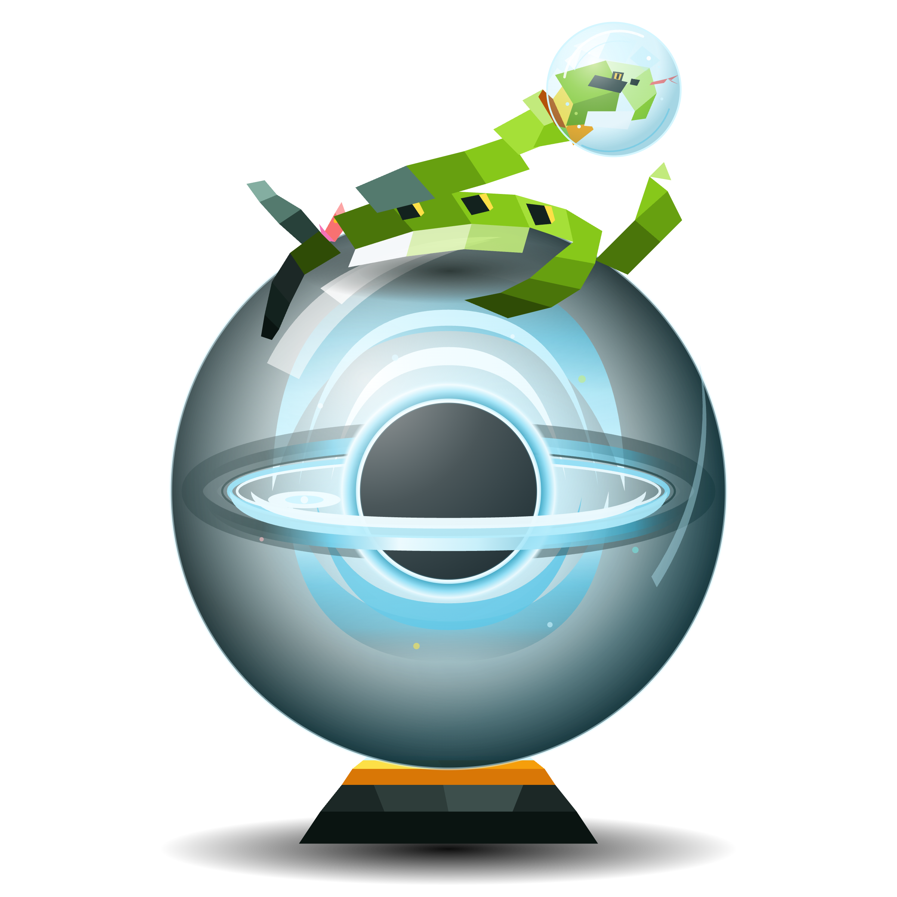

<h1 align="center">Hola, soy Josias 👋</h1>

 

<table>
<tr>
<td width="55%" align="center" valign="middle">

  

<i>Cada piel que la serpiente abandona es una muerte pequeña, y de esa muerte nace lo que aún no tiene nombre. Entre lo que fue y lo que será, solo queda el vacío, porque no hay renacer sin antes desaparecer.</i>

</td>
<td width="45%" valign="middle">

## Josias 🐍

**Ing. Física** · UAM Azcapotzalco

**Software Engineering** · Hybridge Education

 

📍 México &nbsp;|&nbsp; 🔭 Física &nbsp;|&nbsp; 💻 Código

 

</td>
</tr>
</table>

 

## ⌁ Stack 🛠️

 

## ⌁ Sobre mí 🚀

> Me ha interesado la física y el cosmos desde niño 🌌, y es de los pocos intereses que no se me ha ido con el tiempo, por eso terminé estudiando Ingeniería Física en la UAM Azcapotzalco.
>
> Una meta a futuro es hacer una estancia en el **CERN**. ⚛️
>
> Fuera de eso toco guitarra y piano 🎸🎹, y tengo una tortuga caimán que se llama Leviatán. 🐢

 

## ⌁ Proyectos 💡

 

**LOTANI**
 
Carnet digital para mascotas exóticas — salud, vacunas y trazabilidad legal, asistido por IA. Construido para el concurso CoderCUP.

 

 

  
  

 

`→` [**Ver demo en vivo**](https://lotani.vercel.app/)

 

﹏﹏﹏﹏﹏﹏﹏﹏﹏﹏﹏﹏﹏﹏﹏﹏﹏﹏﹏

