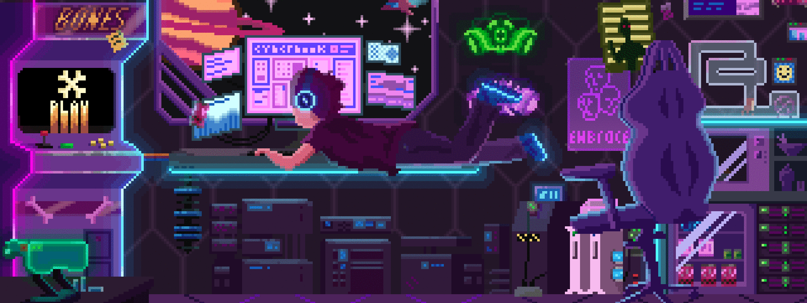
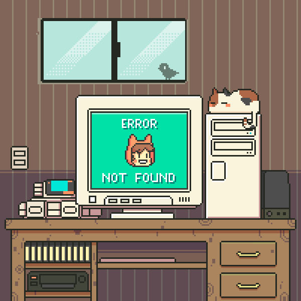

  

<h1 align="center">Hi, I'm Josias </h1>

Physics & Software Engineering student at UAM Azcapotzalco and Hybridge Education. I prefer moving between disciplines rather than staying in one lane, I come from a background in medicine and nursing, and I'm now building my path toward applied physics and software development.

💬 **Ask me about:** Physics, medicine, biology, chemistry, philosophy, history, myths & legends, or how to connect disciplines nobody would think to combine

🔭 **Currently learning:** Python, web development, Git

🎯 **Future goal:** Research internship at CERN ⚛️

🎸 **Outside of code:** I play guitar and piano, game in my free time, and take care of Leviathan, my caiman turtle 🐢🎮

📫 **Contact:** josiasemm@gmail.com

 

  
  &nbsp;
  

  

## ⌁ Languages and Tools

  

  

## ⌁ Projects 

 

**LOTANI** 🦎

🏠 A digital sanctuary for exotic wildlife, ethical care, legal traceability, and AI-assisted health records for your exotic pets.

🌿 Explore Mexico's exotic fauna, consult zootechnical care guides, and manage your specimen's health log, vaccination history, and digital carnet, all in one place.

 

 

  
  

 

`→` [**Live demo**](https://lotani.vercel.app/)

  

## ⌁ Contributions 🚀

 

﹏﹏﹏﹏﹏﹏﹏﹏﹏﹏﹏﹏﹏﹏﹏﹏﹏﹏﹏

