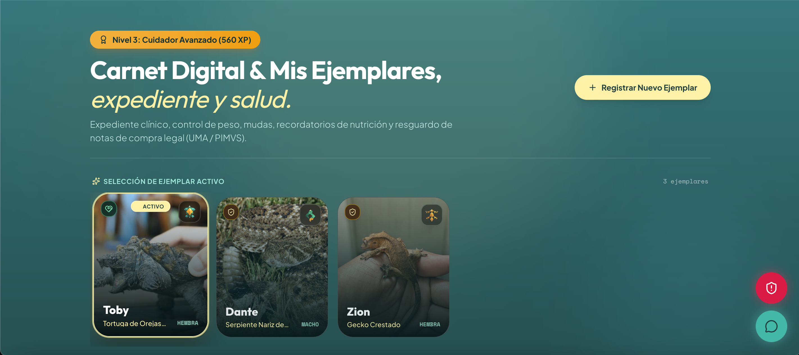

  

<h1 align="center">Hola, soy Josias 👋 </h1>

  <b>🔭 Ingeniería Física</b> — UAM Azcapotzalco &nbsp;|&nbsp; <b>💻 Ingeniería en Software</b> — Hybridge Education

  📍 México

  
  &nbsp;
  

## ⌁ Stack

  
  
  
  

  

## ⌁ Sobre mí 🚀

> Me ha interesado la física y el cosmos desde niño 🌌, y es de los pocos intereses que no se me ha ido con el tiempo, por eso terminé estudiando Ingeniería Física en la UAM Azcapotzalco.
>
> Una meta a futuro es hacer una estancia en el **CERN**. ⚛️
>
> Fuera de eso toco guitarra y piano 🎸🎹, y tengo una tortuga caimán que se llama Leviatán. 🐢

## ⌁ Proyectos 💡

 

**LOTANI**
 
Carnet digital para mascotas exóticas — salud, vacunas y trazabilidad legal, asistido por IA. Construido para el concurso CoderCUP.

 

 

  
  

 

`→` [**Ver demo en vivo**](https://lotani.vercel.app/)

 

## ⌁ Contribuciones 🐍

  <picture>
    <source media="(prefers-color-scheme: dark)" srcset="https://raw.githubusercontent.com/josiasemm/josiasemm/output/github-contribution-grid-snake-dark.svg">
    <source media="(prefers-color-scheme: light)" srcset="https://raw.githubusercontent.com/josiasemm/josiasemm/output/github-contribution-grid-snake.svg">
    
  </picture>

 

﹏﹏﹏﹏﹏﹏﹏﹏﹏﹏﹏﹏﹏﹏﹏﹏﹏﹏﹏

